\newpage

# 1 Цель работы

Целью данного этапа является закрепление практических навыков работы с удалённым сервером, обменом файлами, запуском приложений, контролем процессов, многопоточными приложениями и менеджером терминалов tmux.
# 2 Задание

Выполнить интерактивные задания на платформе Stepik по темам: знакомство с сервером, обмен файлами, запуск приложений, контроль запускаемых программ, многопоточные приложения, менеджер терминалов tmux.

# 3 Выполнение первого этапа Stepik

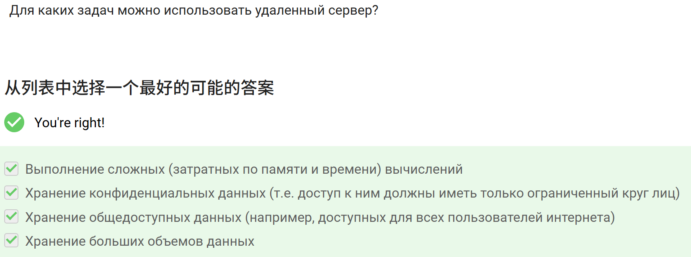{#fig-001 width=80%}

Все четыре варианта верны. Удалённый сервер можно использовать:

· для сложных вычислений (он берёт на себя нагрузку);
· для хранения конфиденциальных данных (доступ можно ограничить);
· для хранения общедоступных данных (например, веб-сервер);
· для хранения больших объёмов данных (емкость сервера масштабируется).

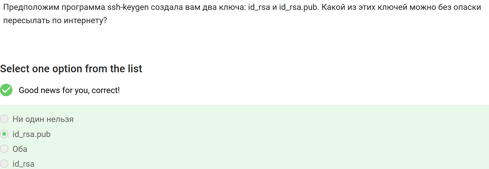{#fig-002 width=80%}

Это публичный ключ, его можно свободно передавать по сети. Приватный ключ id_rsa нужно хранить в секрете.

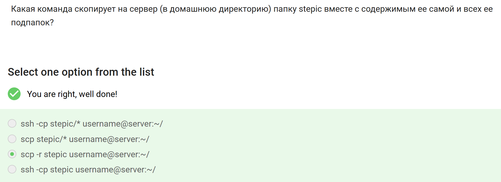{#fig-003 width=80%}

Ключ -r обеспечивает рекурсивное копирование всей папки со всем содержимым.

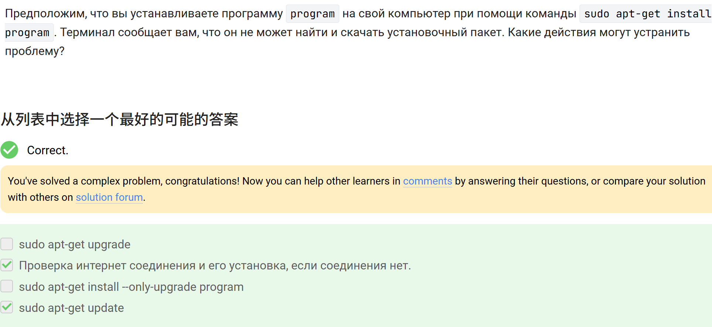{#fig-004 width=80%}

update обновляет список доступных пакетов, что часто решает проблему с поиском. upgrade и --only-upgrade здесь не помогут.

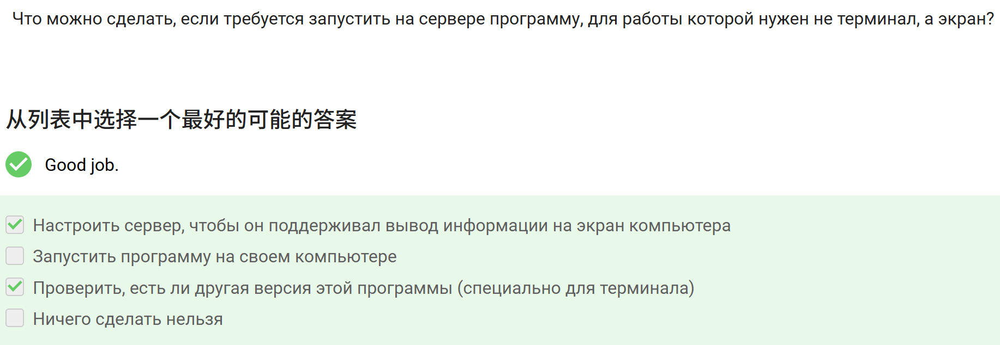{#fig-005 width=80%}

Настроить сервер, чтобы он поддерживал вывод информации на экран компьютера (например, через X11 forwarding)
· Проверить, есть ли другая версия этой программы (специально для терминала)

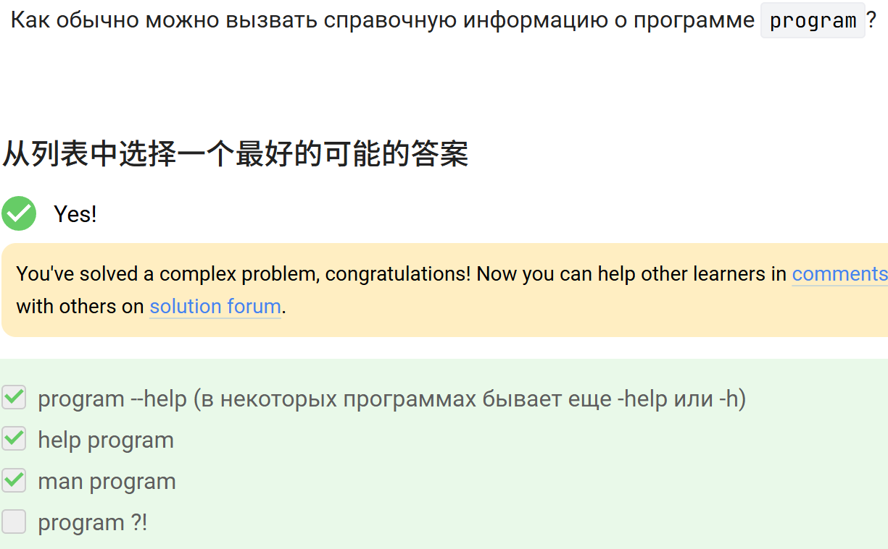{#fig-006 width=80%}

man program и program --help (и его краткие формы -help или -h).

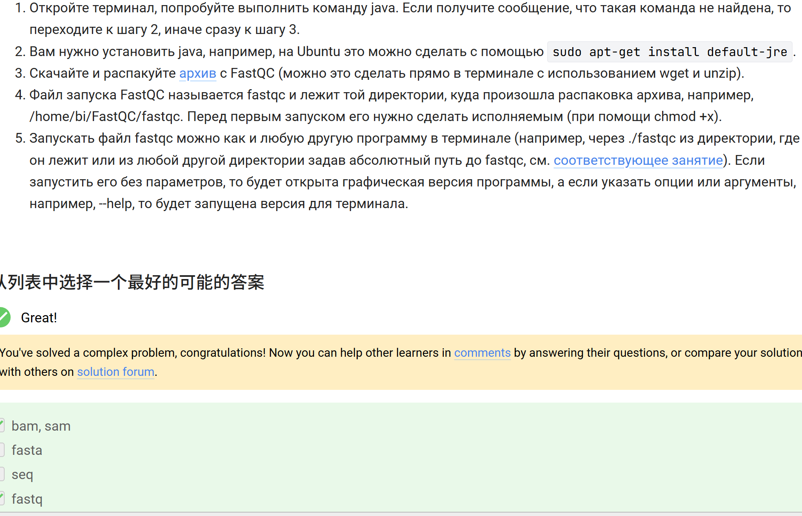{#fig-007 width=80%}

FastQC принимает на вход файлы с данными секвенирования:

· FASTQ (стандарт для сырых ридов с качеством)
· BAM/SAM (выровненные данные)

Форматы fasta (без оценок качества) и seq (нестандартный) не поддерживаются.

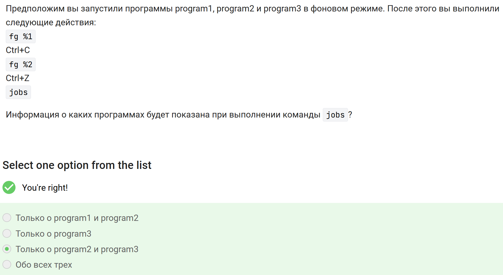{#fig-008 width=80%}

· fg %1 → program1 на передний план, Ctrl+C → завершает её (удаляется из списка задач).
· fg %2 → program2 на передний план, Ctrl+Z → приостанавливает её (остаётся в jobs как остановленная).
· program3 всё это время работала в фоне, поэтому тоже отображается в jobs.

Итог: jobs покажет остановленную program2 и фоновую program3.

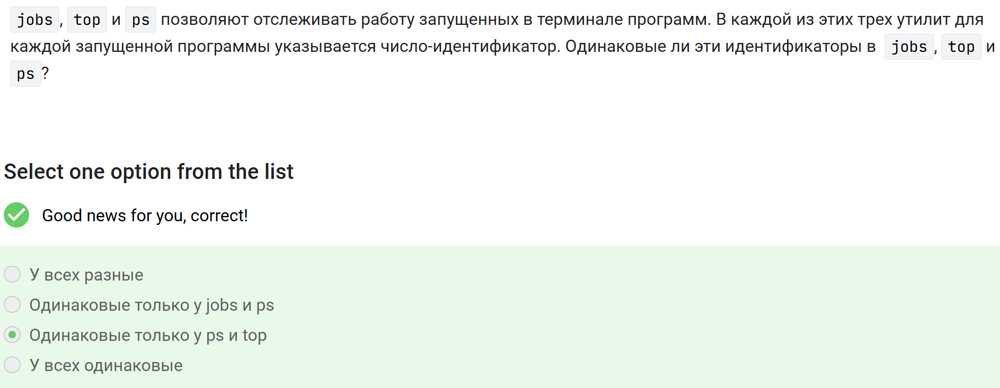{#fig-009 width=80%}

· jobs показывает номера задач (job ID) в рамках текущей сессии оболочки — это не PID.
· ps и top показывают PID (идентификаторы процессов), и они совпадают между собой.
· Таким образом, одинаковые идентификаторы только у ps и top.

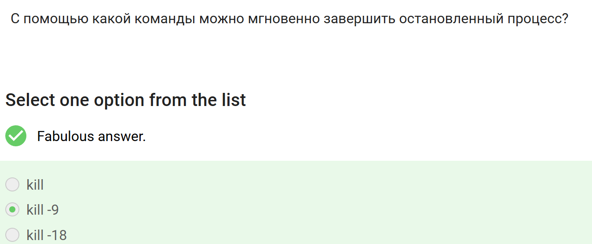{#fig-010 width=80%}

Сигнал SIGKILL (9) мгновенно завершает процесс, в том числе остановленный. Обычная команда kill (без номера) посылает SIGTERM, который может быть проигнорирован. kill -18 возобновляет процесс, а не завершает его.

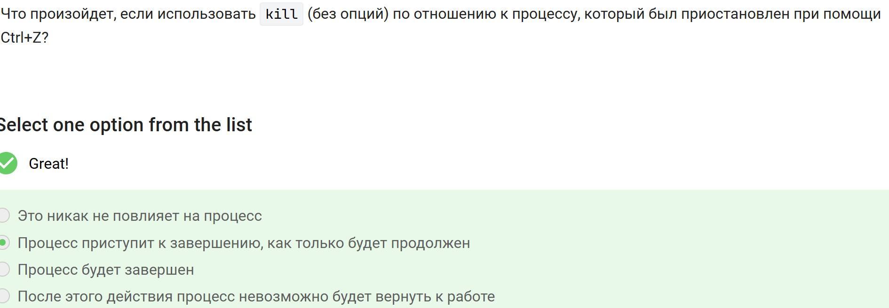{#fig-011 width=80%}

Краткое пояснение:
kill (без опций) посылает сигнал SIGTERM. Приостановленный (T-статус) процесс не принимает сигналы, пока не будет возобновлен (например, fg или kill -18). После возобновления он получит SIGTERM и завершится.

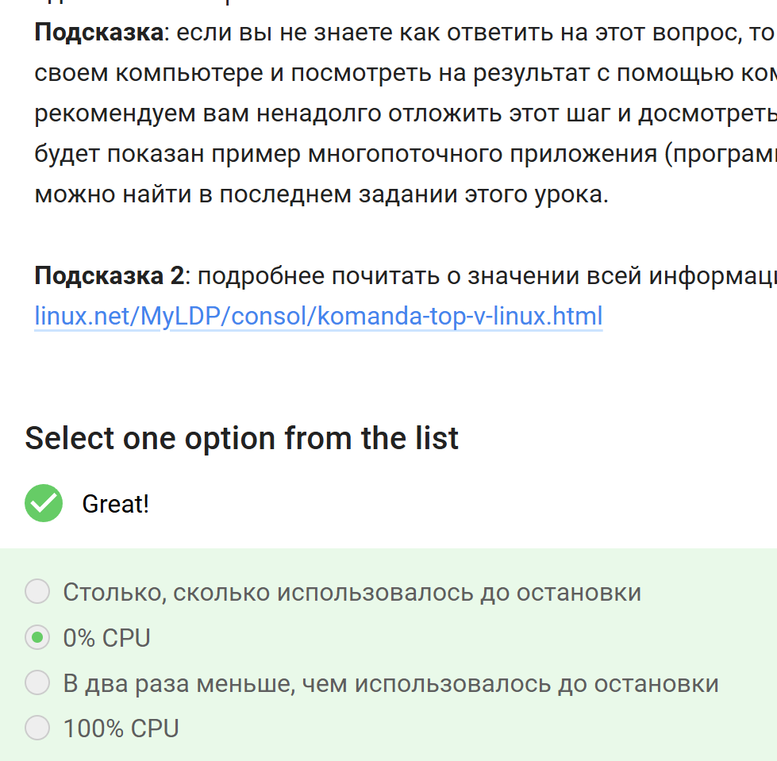{#fig-012 width=80%}

Остановленный по Ctrl+Z процесс не выполняется и не получает процессорное время. В утилите top для него в столбце %CPU будет 0, а в строке статистики процессов (Tasks) он отображается как stopped.

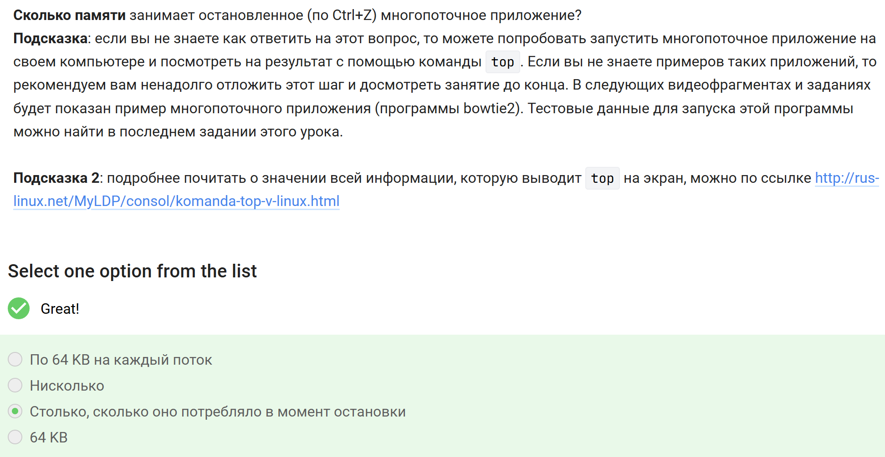{#fig-013 width=80%}

При остановке процесса (Ctrl+Z) его образ в памяти не выгружается — сохраняются все данные, кучи, стеки потоков. В top для такого процесса статус S меняется на T (stopped), а столбцы VIRT, RES, SHR продолжают показывать ту же память, что и до остановки.

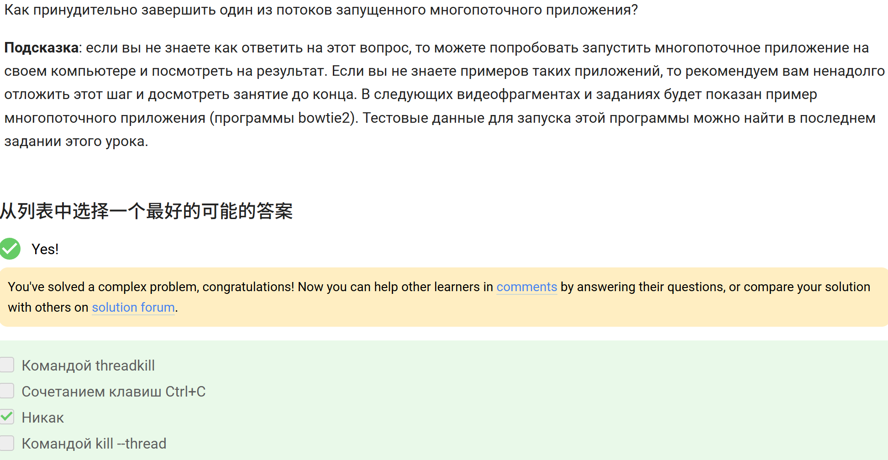{#fig-014 width=80%}

В стандартных средствах Linux нет команды для принудительного завершения отдельного потока внутри процесса. Можно завершить только весь процесс целиком (например, kill, Ctrl+C). Специальных утилит threadkill или kill --thread не существует.

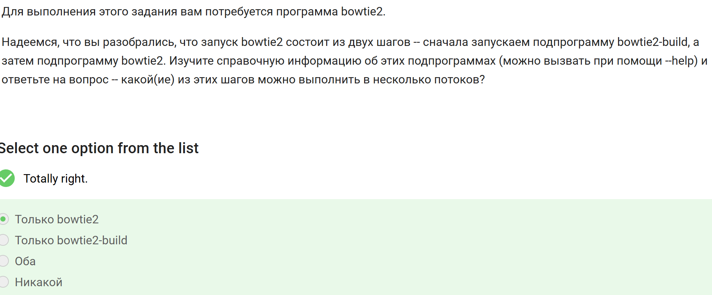{#fig-015 width=80%}

· bowtie2-build (построение индекса) не поддерживает многопоточность — работает в одном потоке.
· bowtie2 (выравнивание) поддерживает многопоточность через опцию -p (или --threads).

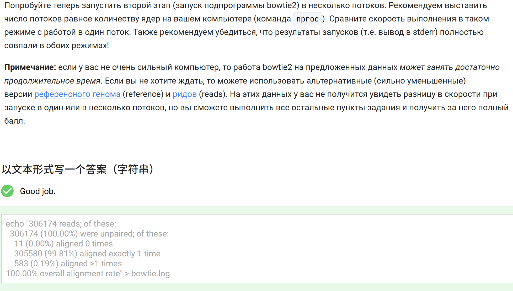{#fig-016 width=80%}

Это содержимое stderr программы bowtie2 при выравнивании на предоставленных данных. В нём содержится статистика по количеству прочитанных ридов, доле выровнявшихся 0, 1 и более раз, а также общий процент выравнивания. Именно этот вывод требуется сохранить в файл и загрузить в форму для получения балла.

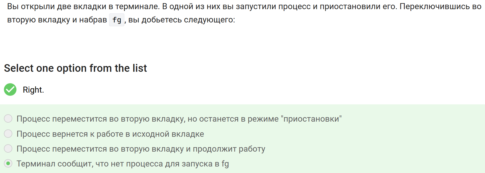{#fig-017 width=80%}

Каждая вкладка терминала — это отдельная сессия оболочки (shell). Команда fg работает только с фоновыми/остановленными процессами текущей сессии. Приостановленный процесс в первой вкладке не виден во второй, поэтому fg во второй вкладке выдаст сообщение об отсутствии такого задания.

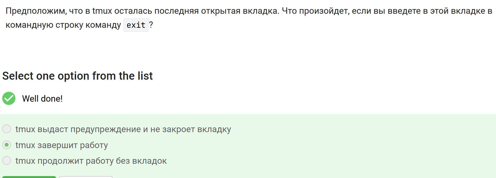{#fig-018 width=80%}

Если в сессии tmux осталась только одна вкладка (окно), то команда exit в ней закрывает последнее окно, после чего сессия завершается, и tmux полностью останавливается.

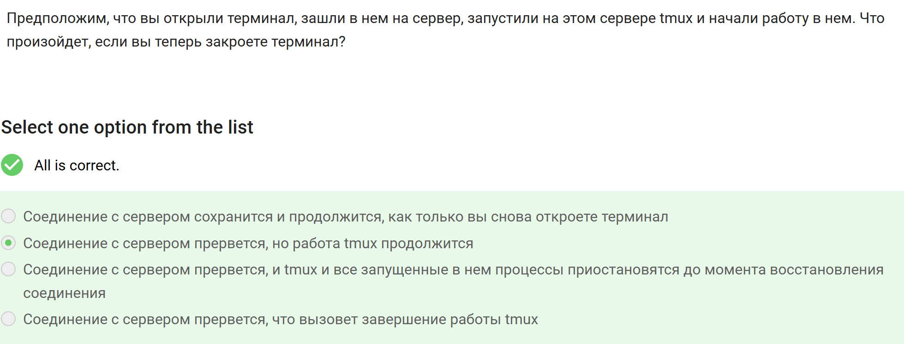{#fig-019 width=80%}

Tmux работает как серверный процесс независимо от терминала. Закрытие терминала разрывает SSH-соединение, но tmux и все его процессы продолжают выполняться на сервере. Позже можно переподключиться к той же сессии командой tmux attach.

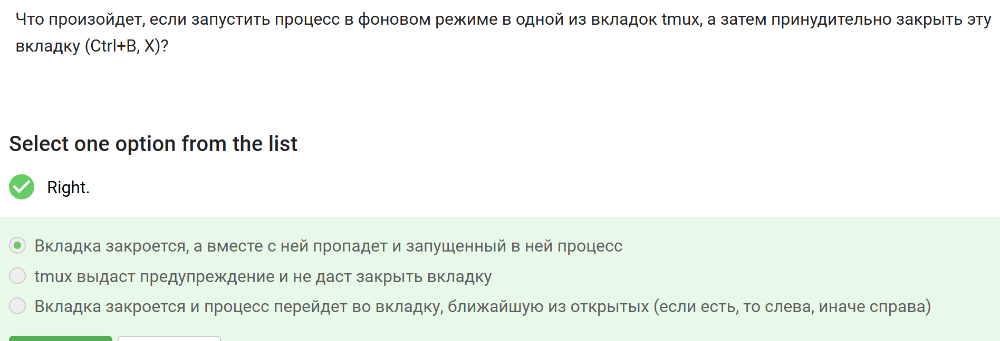{#fig-020 width=80%}

При закрытии окна в tmux (Ctrl+B, X) завершается оболочка и все связанные с ней процессы, включая фоновые. Никакого предупреждения или переноса процессов в другое окно не происходит.

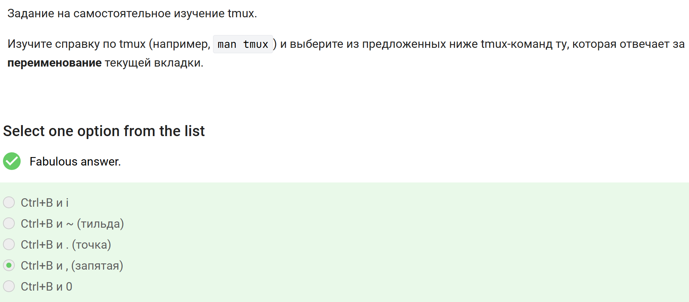{#fig-021 width=80%}

В tmux для переименования текущего окна (вкладки) используется сочетание Ctrl+B , — после этого вводится новое имя. Остальные комбинации отвечают за другие действия: i — информация, ~ — показ сообщений, . — изменение номера окна, 0 — переход к окну 0.

# 4 Выводы

Освоены навыки работы с удалённым сервером, копированием файлов, управлением процессами, многопоточными приложениями и менеджером терминалов tmux.

